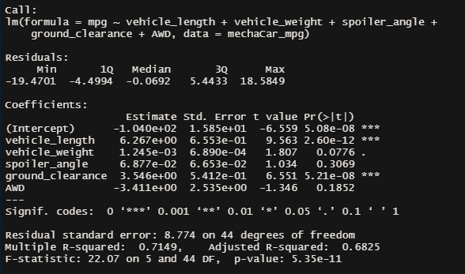
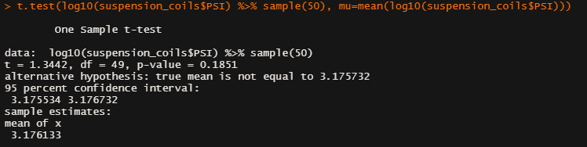
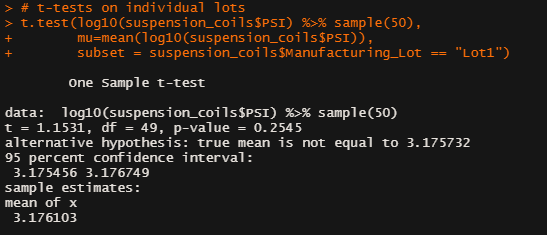
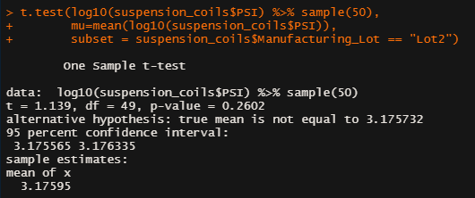
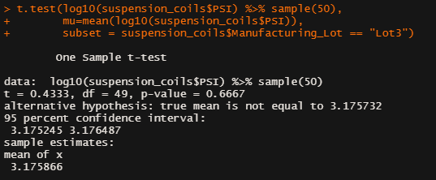

# RBCModule15-Challenge

## Description of Project

This project is meant to exemplify basic usage of R and RStudio using the supplied data sets [MechaCar_mpg](MechaCar_mpg.csv) and [Suspension_Coil](Suspension_Coil.csv). We first perform a multilinear regression on the MechaCar_mpg dataset to determine the most contributive variables. We then provide summary statistics for the Suspension_Coil Dataset and perform T-Tests. Finally, we design a study to compare the MechaCar prototype to vehicles of manufacturing competitors

## Linear Regression to Predict MPG

||
|:-:|
||

Looking at the summary table above, we examine the ```Pr(>|t|)``` column for our relevant **p-values**. It is clear that vehicle_length and ground_clearance are our most significant factors far surpassing our alpha of 0.05. With their extreme significance, and the presence of significant variables at all, we presume that we are not overfitting our data. We note that vehicle_weight is quite close to our alpha as well, so could be examined in the abscence of other skewing factors.

Our Multiple R-squared is also statistically significant at ```0.7149``` and so the slope of our linear model is considered non-zero and our linear model can be said to predict the mpgs of our prototypes with some reasonable effectiveness.

## Summary Statistics on Suspension Coils

For the summary statistics files, you can follow these links: [total_summary](suspension_total_summary.CSV), [lot_summary](suspension_lot_summary.csv), although the results are shown here below.

### Total Summary

|Mean_PSI|Median_PSI|Variance_PSI    |SD_PSI          |
|--------|----------|----------------|----------------|
|1498.78 |1500      |62.2935570469799|7.89262675203762|

### Lot Summary

|Manufacturing_Lot|Mean_PSI|Median_PSI      |Variance_PSI    |SD_PSI           |
|-----------------|--------|----------------|----------------|-----------------|
|Lot1             |1500    |1500            |0.979591836734694|0.989743318610787|
|Lot2             |1500.2  |1500            |7.46938775510204|2.73301806710128 |
|Lot3             |1496.14 |1498.5          |170.28612244898 |13.0493724925369 |

As we can see, the variance amongst all the prototypes does not exceed specifications, however, there is extreme variance amongst variances between the lots. In particular, **Lot 3** has a PSI variance of 170 whereas **Lot 1** has a PSI variance of less than 1. While the metadata does not indicate that the production facilities were different or that the manufacturing processes were, it is clear that there are significant problems with the Lot 3 process and those vehicles do not meet design specifications of less than 100 PSI variance.

## T-Tests on Suspension Coils

For this section we perform t-tests on a sample of the total population and from each manufacturing lot. As we can see from each of the resulting p-values, they are each quite high and so we accept the null hypotheses that there is no meaningful difference in the samples and the population mean. This matches our summary data in that the means of each category were relatively close to the median.

### Sample of Total Population



### Lot 1



### Lot 2



### Lot 3


## Study Design: MechaCar vs Competition

Once our manufacturing process is ironed out, we would like to compare our prototypes against vehicles of the competition. Some metrics we would like to examine are:

- cost
- fuel efficiency
- horse power
- safety rating
- subjective appearance assessments on a scale of 1 to 10

For each of these metrics we would presume a null hypothesis that our car is no better than the competition with respect to the mean values of the metrics. Our alternative hypothesis would be that our car does indeed perform better on these metrics. We would collect statistical data from representative samples of vehicles and perform summary and t-tests to determine if our product differs from the mean in each metric category.